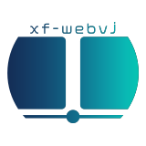

# xf-webvj

<!--  -->

## 概要

xf-webvjは、Web上で動作するVJアプリケーションです。2つのデッキを持ち、指定されたフォルダに格納された動画ファイルをロードする事が出来ます。

バックエンドでyt-dlpを実行する事で、アプリケーション内でYoutubeやniconicoのURLから動画を直接ダウンロード出来ます。

## 主な特徴
- 2つの独立したデッキによる動画再生
- デッキ間のスムーズなクロスフェード
- 再生速度の調整（BPM計算機能付き）
- 各デッキの透明度制御
- 動画のダウンロードと管理
- リアルタイムプレビュー
- WebSocketによるダッシュボードと出力画面の同期
- MIDIアサインによる制御

## インストールと実行方法

### Dockerを使用する場合（推奨）

#### 前提

- 使用するシステムに`docker`がインストールされている事

```bash
# 動画保存用のディレクトリを作成
mkdir -p videos

# コンテナを実行
docker run -p 4173:4173 -p 5901:5901 -v $(pwd)/videos:/app/static/videos uboar/xf-webvj:latest
```

### ローカル開発環境での実行

#### 前提
  
- 使用するシステムに`Node.js`及び`ffmpeg`、`yt-dlp`がインストールされていること

```bash
# リポジトリをクローン
git clone https://github.com/uboar/xf-webvj.git
cd xf-webvj

# 依存関係のインストール
npm install -g pnpm
pnpm install

# 環境変数の設定
cp .env.example .env
# 必要に応じて.envファイルを編集

# 動画保存用のディレクトリを作成
mkdir -p static/videos

# アプリケーションのビルド
pnpm build

# アプリケーションの実行
pnpm preview
```

## 使い方

1. ブラウザで `http://localhost:4173/dashboard` にアクセスしてダッシュボードを開きます
2. 別のウィンドウまたはモニターで `http://localhost:4173/output` にアクセスして出力画面を開きます
3. 「動画ダウンロード」タブから動画をダウンロードするか、`static/videos` ディレクトリに直接動画ファイルを配置します
4. 「動画リスト」タブから各デッキに動画をロードします
5. 再生、停止、速度調整などの操作を行います
6. クロスフェーダーを使用して2つのデッキ間の映像をミックスします
7. MIDIアサイン機能を使用することでお好きなMIDIコントローラからも制御が可能です

## 開発環境のセットアップ

```bash
# 依存関係のインストール
pnpm install

# 開発サーバーの起動
pnpm dev

# 型チェック
pnpm check

# テストの実行
pnpm test

# コードのフォーマット
pnpm format
```

## APIエンドポイント

- `POST /api/download-movie`: 動画のダウンロード
- `GET /api/get-movie?video={filename}`: 指定した動画ファイルの取得
- `GET /api/get-movie-list`: 利用可能な動画のリスト取得
- `POST /api/rename-movie`: 動画ファイルの名前変更
- `POST /api/delete-movie`: 動画ファイルの削除

## WebSocket通信

WebSocketサーバーはポート5901（デフォルト）で実行され、ダッシュボードと出力画面間の通信を処理します。

主な通信内容:
- デッキの状態（再生/停止、位置、速度など）
- 透明度とクロスフェード値
- 動画読み込み状態
- 出力ページの接続状態

## 環境変数

`.env`ファイルで以下の環境変数を設定できます:

- `PUBLIC_WS_SERVER_PORT`: WebSocketサーバーのポート番号（デフォルト: 5901）
- `PUBLIC_MOVIE_PATH`: 動画ファイルの保存パス（デフォルト: ./static/videos）